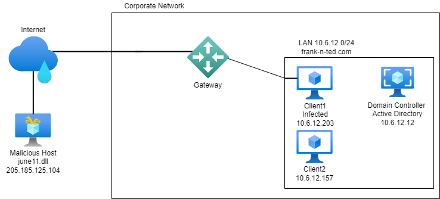
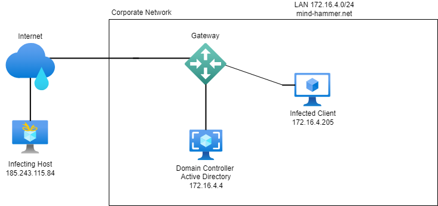

# Wireshark-Reality-Bytes
Using Wireshark to Analyze Vulnerable Networks

## 3 Scenarios: Malware, Infected Hosts, Illegal Torrents

The files in this repository were produced by the networks depicted below.

Fig. A - Malicious Host

Fig. B - Infected Client

Fig. C - Illegal Downloads

### Contents of Offensive Security Presentation
- Reveal critical weaknesses in a target host computer
- Use of NMAP to expose network IPs and vulnerable ports
- Launch a brute force attack in Kali Linux using WPScan (Penetration test on WordPress publishing software)
- Propose additional stealth methods to avoid further detection

### Feature Presentation 

Access and download the main [Powerpoint](https://github.com/isejy07/Project3-OffSec-Final/blob/main/Presentation/Team_Offensive_Final_Project_Presentation.pptx) file for review.

### Supporting Documents 

Access additional materials [here](https://github.com/isejy07/Project3-OffSec-Final/tree/main/Documentation).

